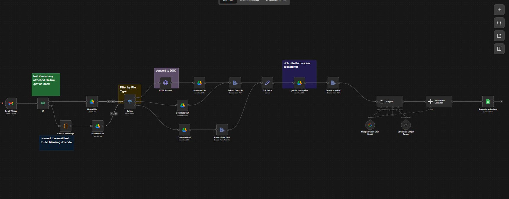
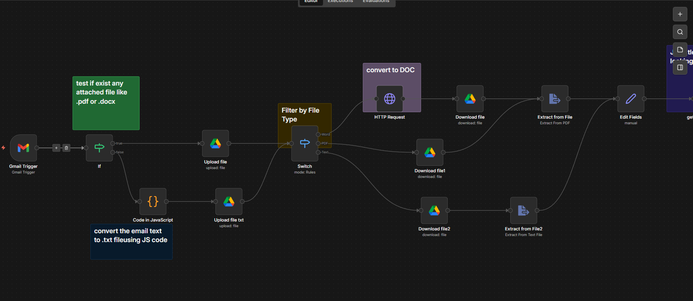
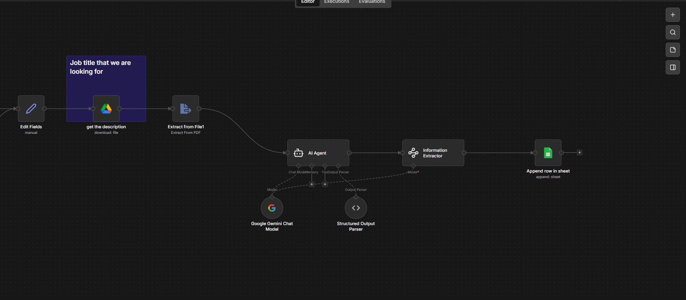
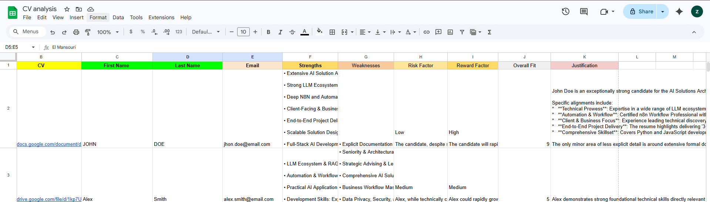

# HR CV Analysis

An n8n workflow that uses an AI agent to automatically analyze CVs received from Gmail, extract key candidate information, evaluate their fit for a job, and store structured results in Google Sheets.

## Workflow Preview





## What this project does

This workflow automatically:

* Receives CVs from Gmail
* Detects file type (PDF / DOCX / TXT / no attachment)
* Converts and extracts text from files
* Uses an AI Agent to analyze the candidate
* Extracts structured information (name, email, strengths, etc.)
* Saves results into Google Sheets

## AI Analysis Output

For each candidate, the system generates:

* First Name
* Last Name
* Email
* Candidate Strengths
* Candidate Weaknesses
* Risk Factor (Low / Medium / High)
* Reward Factor (Low / Medium / High)
* Overall Fit Score (0–10)
* Justification for the score

## How the workflow works

### 1. Email Trigger (Gmail)

The workflow starts when a new email arrives with a CV attachment.

It checks if attachments exist using:

```javascript
{{ Object.keys($binary).length }}
```

This checks how many files are attached.

### Case 1: Candidate sends PDF or DOCX CV

If an attachment exists:

* Upload file to Google Drive
* Detect file type using a Switch node
* Convert DOCX → Google Docs
  ```
  https://googleapis.com{{ $json.id }}/copy?convert=true
  ```
* Download file as PDF
* Extract text from the file
* Send extracted text to AI Agent for analysis

### Case 2: Candidate sends PDF CV

Same process as DOCX:

* Upload to Google Drive
* Download using file ID:
  `{{ $json.id }}`
* Extract text
* Send to AI Agent

### Case 3: No attachment (pure email text)

If no binary file exists:

```javascript
{{ Object.keys($binary).length }} === 0
```

We convert the email body into a .txt file using JavaScript:

```javascript
// Convert email text to binary file
const item = $input.first().json;

const emailText = item.text || "No text content found";
const senderName = item.from?.value?.?.name || "Unknown_Candidate";
const subject = item.subject || "email";

const safeName = senderName.replace(/[^a-zA-Z0-9]/g, "_");
const safeSubject = subject.replace(/[^a-zA-Z0-9]/g, "_");

const buffer = Buffer.from(emailText, "utf-8");

return [
  {
    json: item,
    binary: {
      data: {
        data: buffer.toString("base64"),
        mimeType: "text/plain",
        fileName: `${safeSubject}_${safeName}.txt`,
      },
    },
  },
];
```

Then:

* Upload .txt file to Google Drive
* Process it like other CVs

### AI Agent (Core Intelligence)

The AI Agent:

* Reads CV text
* Compares it with job description
* Evaluates candidate fit
* Produces structured JSON output

It uses:

* Structured Output Parser
* Information Extractor

### Final Step: Google Sheets

All results are stored in a Google Sheet:

* Candidate info
* AI analysis
* Scores
* Justification
* CV link
* Time




## Key Logic Summary

* `Object.keys($binary).length` → checks attachments
* Switch node → separates file types
* Google Drive → storage + conversion
* ExtractFromFile → text extraction
* AI Agent → evaluation engine
* Google Sheets → final database

## Purpose

This project helps automate:

* CV screening
* Recruitment filtering
* HR decision making
* Candidate evaluation at scale

## Notes

* Works with PDF, DOCX, and plain text emails
* Requires Google API credentials in n8n
* AI output depends on job description quality
